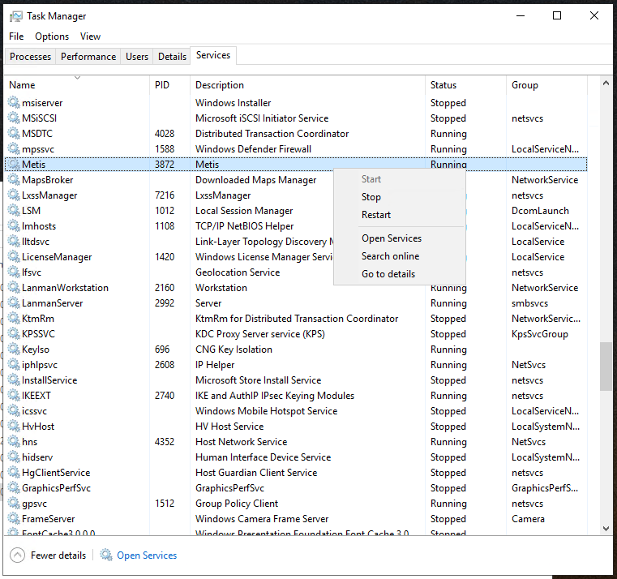
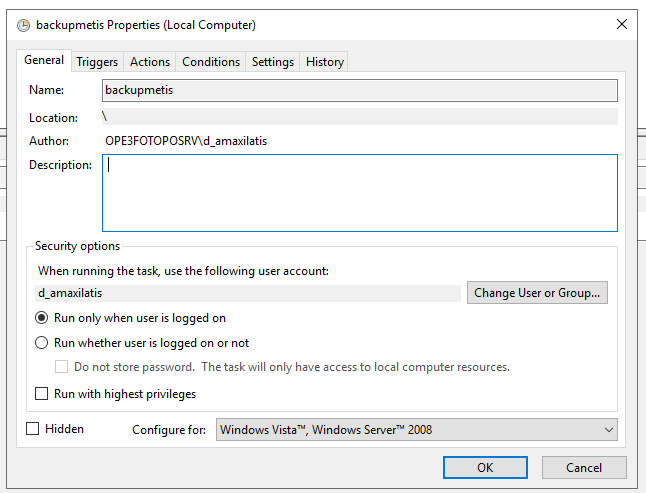
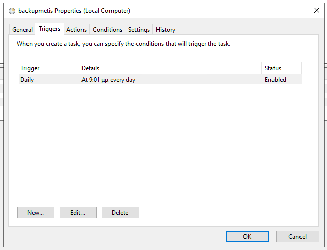
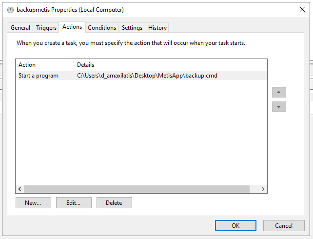
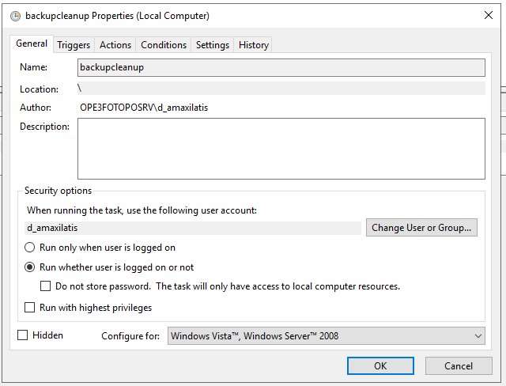
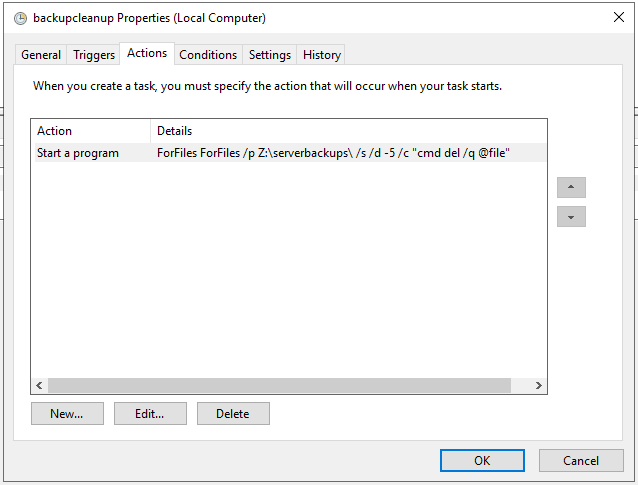

= METIS - Εφαρμογή Για Το Μαζικό Έλεγχο Ορθοφωτοχαρτών
:author: ΦΩΤΟΠΟ ΑΝΩΝΥΜΟΣ ΕΤΑΙΡΕΙΑ ΜΕΛΕΤΩΝ ΑΝΑΠΤΥΞΗΣ & ΓΕΩΓΡΑΦΙΚΩΝ ΣΥΣΤΗΜΑΤΩΝ ΠΛΗΡΟΦΟΡΙΩΝ
:revnumber: 0.18.0
:description: Ο οδηγός αυτός περιγράφει την παραμετροποίηση / διαχείριση της εφαρμογής Metis για τον μαζικό έλεγχο ορθοφωτοχαρτών από τον διαχειριστή του συστήματος.
:doctype: book
:sectanchors:
:sectlinks:
:toc: left
:sectnums:
:appendix-caption: Παράρτημα
:appendix-refsig: {appendix-caption}
:caution-caption: Προσοχή
:chapter-signifier: Κεφάλαιο
:chapter-refsig: {chapter-signifier}
:example-caption: Παράδειγμα
:figure-caption: Εικόνα
:important-caption: Σημαντικό
:last-update-label: Τελευταία ενημέρωση
ifdef::listing-caption[:listing-caption: Καταχώρηση]
ifdef::manname-title[:manname-title: Ονομα]
:note-caption: Σημείωση
:part-signifier: Μέρος
:part-refsig: {part-signifier}
ifdef::preface-title[:preface-title: Πρόλογος]
:section-refsig: Ενότητα
:table-caption: Πίνακας
:tip-caption: Υπόδειξη
:toc-title: Πίνακας Περιεχομένων
:untitled-label: Χωρίς τίτλο
:version-label: Έκδοση
:warning-caption: Προειδοποίηση

{description}

== Εκτέλεση Εφαρμογής

Η εφαρμογή εκτελείται ως Window Service ακολουθώντας τα βήματα περιγράφονται παρακάτω για την εγκατάστασή της, τη διαχείρισή της καθώς και τη λήψη αντιγράφων ασφαλείας από αυτήν.

=== Windows Service

Η εφαρμογή `Metis` εκτελείται ως Windows Service και για την εγκατάστασή της απαιτείται η εκτέλεση της παρακάτω εντολής μέσα στον αντίστοιχο φάκελο του release πακέτου της εφαρμογής.

```
Metis.exe install Metis.xml
```

Το αρχείο `Metis.xml` περιέχει παραμέτρους για τον τρόπο εκτέλεσης και τα δικαιώματα πρόσβασης της εφαρμογής στο σύστημα.
Τα στοιχεία εκτέλεσης για την εφαρμογή Metis φαίνονται παρακάτω:

```
<service>
    <id>Metis</id>
    <name>Metis</name>
    <description>This runs Metis Spring Boot as a Service.</description>
    <env name="MYAPP_HOME" value="C:\Users\user\MetisApp\"/> (!change with actual home)
    <executable>java</executable>
    <arguments>-Xmx15256m -D"spring.profiles.active=opekepe" -D"spring.config.import=optional:file:settings.yml" -jar "metis-server.jar"</arguments>
    <logmode>rotate</logmode>
    <serviceaccount>
      <username>username</username> (!change with actual username)
      <password>password</password> (!change with actual password)
      <allowservicelogon>true</allowservicelogon>
    </serviceaccount>
    <sharedDirectoryMapping>
      <map label="Z:" uncpath="\\ope3filesrv\FOTOPO" />
    </sharedDirectoryMapping>
</service>

```

== Παραμετροποίηση Εφαρμογής

Για την παραμετροποίηση της εφαρμογής χρησιμοποιείται το αρχείο `settings.yml` το οποίο μας επιτρέπει να τροποποιήσουμε παραμέτρους όπως:

. Αρχείο SSL Certificate για ασφαλή πρόσβαση (`server.ssl.key-store`).
. Κωδικός αρχείου SSL Certificate (`server.ssl.key-store-password`) - δείτε την παρακάτω ενότητα.
. Κωδικός κλειδιού SSL Certificate (`server.ssl.key-password`) - δείτε την παρακάτω ενότητα.
. Διαδρομή Αρχείων Ορθοφωτοχαρτών (`metis.filesLocation`).
. Διαδρομή Αντιγράφων Ασφαλείας Συστήματος (`metis.dbBackupLocation`).
. Στοιχεία Σύνδεσης Active Directory (`metis.ldap.*`).
. Αριθμός Θέσεων Επεξεργασίας (`metis.processing.threads`).

Παράδειγμα αρχείου `settings.yml`

```
server:
  ssl:
    key-store: file:metiscert.p12
    key-store-password: password (!change with actual password)
    key-store-type: pkcs12
    key-alias: 1
    key-password: password (!change with actual password)
metis:
  filesLocation: "Z:\\"
  dbBackupLocation: "Z:\\serverbackups\\"
  ldap:
    domain: opekepe.gr
    url: "ldap://DC2.opekepe.gr ldap://DC3.opekepe.gr"
    use: true
  processing:
    threads: 2
```

Μετά από κάθε αλλαγή στις παραμέτρους της εφαρμογής απαιτείται επανεκκίνηση της με τη διαδικασία που περιγράφεται παρακάτω.

=== Επανεκκίνηση Εφαρμογής

Για την επανεκκίνηση της εφαρμογής χρειάζεται να συνδεθούμε στο VM το οποίο εκτελεί την εφαρμογή και να ανοίξουμε την καρτέλα `Services` του `Task Manager`.
Εκεί στο service με όνομα `Metis` με δεξί κλίκ μπορούμε να επιλέξουμε `Restart` για την επανεκκίνησή της.

.Επανεκκίνηση Εφαρμογής
[#service-restart]


=== Μετατροπή Certificate

Η εφαρμογή χρησιμοποιεί SSL certificates μορφής `.p12` για τη φόρτωση του πιστοποιητικού και του αντίστοιχου private key.
Για τη μετατροπή του πιστοποιητικού από τη μορφή `.pfx` γίνεται χρήση του εργαλείου `keytool` του `jdk` μέσω της παρακάτω εντολής:

```
keytool.exe -importkeystore -destkeystore metiscert.p12 -deststoretype pkcs12 -srckeystore source.pfx
```

Με την εκτέλεση της εφαρμογής θα πρέπει να δωθεί από το χρήστη ένας κωδικός για την αποθήκευση του keystore στη μορφή `.p12` καθώς και ο κωδικός του `.pfx` keystore.

Το keystore που δημιουργείται πρέπει να τοποθετηθεί μέσα στο φάκελο της εφαρμογής και να γίνει επανεκκίνηση της εφαρμογής για να φορτωθεί το νέο certificate.

=== Ενημέρωση Certificate

Για την ενημέρωση του SSL πιστοποιητικού όταν το προηγούμενο έχει λήξει χρειάζεται να:

* Μετατροπή του νέου certificate από `.pfx` σε `.p12` με βάση το 2.2
* Προσθήκη του αρχείου `.p12` με το νέο πιστοποιητικό στο φάκελο της εφαρμογής με όνομα `metiscert.p12`
* Ενημέρωση του αρχείου `settings.yml` στο φάκελο της εφαρμογής αν έχει αλλαχθεί ο κωδικός του `.p12` keystore
* Επανεκκίνηση της εφαρμογής σύμφωνα με το 2.1

== Αντίγραφα Ασφαλείας

Η λήψη αντιγράφων ασφαλείας της εφαρμογής γίνεται σε 2 βήματα.
Αρχικά λαμβάνεται ένα αντίγραφο των αρχείων της εφαρμογής από το σύστημα αρχείων του VM όπου εκτελείται η εφαρμογή και στη συνέχεια λαμβάνεται ένα αντίγραφο της embedded βάσης δεδομένων που χρησιμοποιεί η εφαρμογή.

=== Λήψη Αντιγράφων Ασφαλείας embedded Βάσης Δεδομένων

Η λήψη αντιγράφων ασφαλείας της εσωτερικής βάσης δεδομένων της εφαρμογής γίνεται από την ίδια την εφαρμογή καθημερινά στις `00:00` και σε κάθε επανεκκίνηση της εφαρμογής.
Το αντίγραφο ασφαλείας εξάγεται εσωτερικά και μεταφέρεται στη θέση αρχείων αντιγράφων ασφαλείας που έχει οριστεί στις ρυθμίσεις της εφαρμογής στο κλειδί: `metis.dbBackupLocation`.

=== Λήψη Αντιγράφων Ασφαλείας Αρχείων

Για τη λήψη αντιγράφων ασφαλείας των αρχείων της εφαρμογής γίνεται χρήση του Task Scheduler των Windows.
Πιο συγκεκριμένα έχει οριστεί ένα job ``backupmets`` το οποίο εκτελεί το backup script της εφαρμογής `backup.cmd`.

```
@echo off

:: get date to name the backup
set mydate=%date:~10,4%%date:~7,2%%date:~4,2%

:: set main file locations
set destfile=C:\Users\d_amaxilatis\Desktop\%mydate%-files-backup.zip
set backuplocation=Z:\serverbackups\
set backupsource=C:\Users\d_amaxilatis\Desktop\MetisApp

:: zip file contents
"C:\Program Files\7-Zip\7z.exe" a -tzip %destfile% %backupsource% -xr!thumb

:: copy to shared location
copy %destfile% %backuplocation%

:: delete dest file
del %destfile%
```

Το αντίγραφο ασφαλείας του συστήματος μεταφέρεται στο φάκελο που έχει οριστεί για την αποθήκευση των αντιγράφων και διαγράφεται από το σύστημα αρχείων του VM.

.Λήψη Αντιγράφων Ασφαλείας - Γενικά
[#backup-1]

.Λήψη Αντιγράφων Ασφαλείας - Triggers
[#backup-2]

.Λήψη Αντιγράφων Ασφαλείας - Actions
[#backup-3]


=== Εκκαθάριση Αντιγράφων Ασφαλείας

Για την περιοδική εκκαθάριση των αντιγράφων ασφαλείας του συστήματος έχει δημιουργηθεί ένα ακόμη Task στον Task Scheduler των Windows που εκτελεί τη διαγραφή των αντιγράφων ασφαλείας που είναι παλαιότερα των 30 ημερών.

```
ForFiles /p Z:\serverbackups\ /s /d -30 /c "cmd del /q @file"
```

.Εκκαθάριση Αντιγράφων Ασφαλείας - Γενικά
[#clean-1]

.Εκκαθάριση Αντιγράφων Ασφαλείας - Triggers
[#clean-2]

.Εκκαθάριση Αντιγράφων Ασφαλείας - Actions
[#clean-3]


== Επαναφορά της εφαρμογής από αντίγραφα ασφαλείας

Για την επαναφορά της εφαρμογής από τα αντίγραφα ασφαλείας της απαιτούνται τα παρακάτω:

Εξαγωγή των αρχείων της εφαρμογής στη νέα θέση της από το αρχείο με κατάληξη `{date}-files-backup.zip`.

Στο φάκελο αυτό πρέπει να μεταφερθούν και τα στοιχεία του τελευταίου αντιγράφου ασφαλείας της βάσης δεδομένων από το φάκελο `{timestamp}-metisdb-backup`.

Στη συνέχεια μπορεί να γίνει η εκκίνηση της εφαρμογής από το αρχείο `metis-server.jar` ή να οριστεί ξανά το Service της εφαρμογής όπως έχει περιγραφεί στην αρχή του εγγράφου αυτού.
