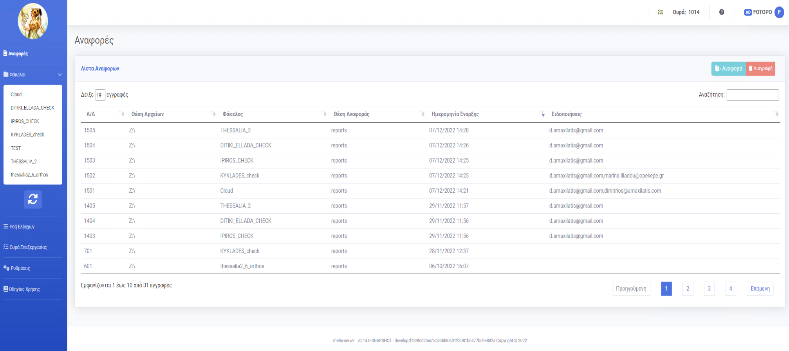
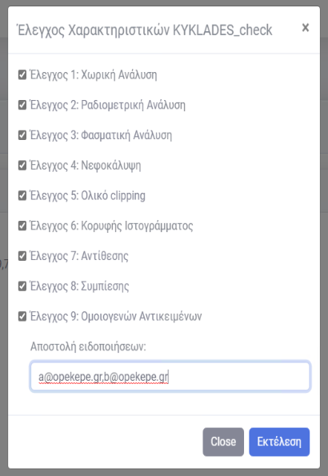

= METIS - Εφαρμογή Για Το Μαζικό Έλεγχο Ορθοφωτοχαρτών
:author: ΦΩΤΟΠΟ ΑΝΩΝΥΜΟΣ ΕΤΑΙΡΕΙΑ ΜΕΛΕΤΩΝ ΑΝΑΠΤΥΞΗΣ & ΓΕΩΓΡΑΦΙΚΩΝ ΣΥΣΤΗΜΑΤΩΝ ΠΛΗΡΟΦΟΡΙΩΝ
:revnumber: 0.3.6
:description: Ο οδηγός αυτός περιγράφει τη χρήση της εφαρμογής Metis για τον μαζικό έλεγχο ορθοφωτοχαρτών καθώς και την παραμετροποίηση / διαχείριση της εφαρμογής.
:doctype: book
:sectanchors:
:sectlinks:
:toc: left
:sectnums:
:appendix-caption: Παράρτημα
:appendix-refsig: {appendix-caption}
:caution-caption: Προσοχή
:chapter-signifier: Κεφάλαιο
:chapter-refsig: {chapter-signifier}
:example-caption: Παράδειγμα
:figure-caption: Εικόνα
:important-caption: Σημαντικό
:last-update-label: Τελευταία ενημέρωση
ifdef::listing-caption[:listing-caption: Καταχώρηση]
ifdef::manname-title[:manname-title: Ονομα]
:note-caption: Σημείωση
:part-signifier: Μέρος
:part-refsig: {part-signifier}
ifdef::preface-title[:preface-title: Πρόλογος]
:section-refsig: Ενότητα
:table-caption: Πίνακας
:tip-caption: Υπόδειξη
:toc-title: Πίνακας Περιεχομένων
:untitled-label: Χωρίς τίτλο
:version-label: Έκδοση
:warning-caption: Προειδοποίηση

{description}

== Μενού και περιοχές

.Αρχική Οθόνη
[#home-img]

Η αρχική οθόνη της εφαρμογής φαίνεται στην παραπάνω εικόνα.
Σε αυτήν μπορούμε να διακρίνουμε τις παρακάτω 4 περιοχές.

. Μπάρα Κατάστασης
. Πλευρικό Μενού
. Υποσέλιδο
. Χώρος Σελίδας

=== Μπάρα Κατάστασης

Η Μπάρα Κατάστασης εμφανίζει μια ένδειξη κατάστασης του συστήματος επεξεργασίας, τις θέσεις επεξεργασίας σε χρήση και σύνολο καθώς και τις εργασίες ελέγχου που βρίσκονται στην ουρά επεξεργασίας.

=== Πλευρικό Μενού

Το Πλευρικό Μενού περιέχει 3 ενότητες.
Η πρώτη επιλογή `Αναφορές` οδηγεί στη σελίδα όπου εμφανίζονται όλες οι αναφορές από τους ελέγχους που έχουν ζητηθεί από τους χρήστες.
Στη δεύτερη ενότητα, εμφανίζεται μια λίστα με όλους τους φακέλους αρχείων που έχουν ανιχνευθεί από το σύστημα στον διαδικτυακό φάκελο της εφαρμογής `\\ope3filesrv\FOTOPO\`.

IMPORTANT: Μόλις προστεθούν νέες εικόνες στον διαδικτυακό φάκελο της εφαρμογής μπορεί να χρειαστεί να γίνει εκ νέου αναζήτηση για εικόνες με τη χρήση του κουμπιού ανανέωσης κάτω από τη λίστα των φακέλων

=== Υποσέλιδο

Στο υποσέλιδο φαίνονται στοιχεία για την έκδοση της εφαρμογής καθώς και την έκδοση του κώδικά της που μπορεί να χρειαστεί σε περίπτωση σφάλματος.

=== Χώρος Σελίδας

Στο Χώρο Σελίδας εμφανίζονται, ανάλογα με τη σελίδα που έχει επιλεγεί από το Πλευρικό Μενού, οι πληροφορίες για την ανάλυση των εικόνων από την εφαρμογή Metis.

== Σελίδες

=== Αναφορές

Η σελίδα `Αναφορές` εμφανίζει μια λίστα με τις αναφορές που έχουν ζητηθεί από όλους τους χρήστες μέσω της εφαρμογής.
Κάθε αναφορά μπορεί να διαγραφεί ή να ανακτηθεί (σε μορφή XLSΧ) μέσω των αντίστοιχων κουμπιών στο πάνω μέρος της λίστας.
Η λίστα των αναφορών μπορεί να ταξινομηθεί ανάλογα με κάθε στήλη του πίνακα ή με χρήση του πλαισίου αναζήτησης στο πάνω μέρος της.

.Σελίδα Αναφορών
[#reports-img]

=== Φάκελοι

Η σελίδα των φακέλων εμφανίζει τα αποτελέσματα από την εκτέλεση των ελέγχων για κάθε εικόνα των Ορθοφωτοχαρτών που περιέχει.
Μέσω του dropdown μενού στο πλαίσιο `Εικόνα` μπορεί να επιλέξει ο χρήστης την εικόνα για την οποία θέλει να δει τα αποτελέσματα και με το κουμπί `Λήψη Εικόνας` μπορεί να κατεβάσει το αρχείο της στον υπολογιστή του (αρχείο .TIF)

.Σελίδα Φακέλου
[#folders-img]
image::img/folders.png[align="center"]

Στο πλαίσιο `Αποτελέσματα Ελέγχων` εμφανίζονται τα αποτελέσματα των ελέγχων που έχουν εκτελεστεί και οι σημειώσεις που προκύπτουν από την εκτέλεσή τους.

Επίσης, στο πλαίσιο `Μικρογραφία` εμφανίζεται η εικόνα σε μικρότερη ανάλυση για να δει ο χρήστης τη μορφή της εικόνας που μπορεί να εξηγεί σε κάποιο βαθμό τα αποτελέσματα των ελέγχων.

Στο πάνω μέρος της σελίδας εμφανίζονται 2 κουμπιά που εκτελούν: 1ον έλεγχο όλων των ορθοφωτοχαρτών που περιέχονται στο φάκελο, και 2ον την εκκαθάριση των ήδη υπολογισμένων αποτελεσμάτων για όλες τις εικόνες του φακέλου.

Για την εκτέλεση των ελέγχων στο φάκελο, εμφανίζονται οι διαθέσιμες επιλογές μέσω ενός modal στο οποίο μπορεί ο χρήστης αν επιλέξει αν θα εκτελεστούν όλοι οι έλεγχοι ή μέρος αυτών.
Για την εκκαθάριση των αποτελεσμάτων αντίστοιχα ο χρήστης μπορεί να επιλέξει να διαγράψει είτε το σύνολο των αποτελεσμάτων είτε μέρος αυτών με σκοπό την εκ νέου εκτέλεση των ελέγχων.

.Έλεγχος Ορθοφωτοχαρτών Φακέλου
[#check-img]

.Διαγραφή Αποτελεσμάτων Ελέγχων Ορθοφωτοχαρτών Φακέλου
[#results-img]
image::img/delete-results.png[align="center"]

=== Ρυθμίσεις

Η σελίδα ρυθμίσεων εφαρμογής εμφανίζει παραμέτρους που αφορούν τις τοποθεσίες στις οποίες η εφαρμογή αναζητεί τις εικόνες των ορθοφωτοχαρτών, αποθηκεύει τα αποτελέσματα των ελέγχων προσωρινά όπως και τις αναφορές των αποτελεσμάτων αλλά και τις μικρογραφίες των εικόνων.

Σε αυτή τη σελίδα εμφανίζονται επίσης οι ρυθμίσεις σχετικά με την επεξεργασία των εικόνων των ορθοφωτοχαρτών και τις θέσεις στην ουρά επεξεργασίας.

Τέλος, εμφανίζονται το σύνολο των ελέγχων που είναι διαθέσιμοι και η κατάστασή τους, `ενεργός` ή `ανενεργός` με τη δυνατότητα (σε μελλοντική έκδοση) να ενεργοποιούνται όσοι έλεγχοι επιθυμούμε ανά πάσα στιγμή.

IMPORTANT: Η δυνατότητα αλλαγής αυτών των ρυθμίσεων είναι για την ώρα ανενεργή και υπάρχει η εμφάνισή τους για την επισκόπησή τους κατά τη χρήση της εφαρμογής.

.Σελίδα Ρυθμίσεων
[#settings-img]

== Εκτέλεση Εφαρμογής

tbd

=== Windows Service

tbd
