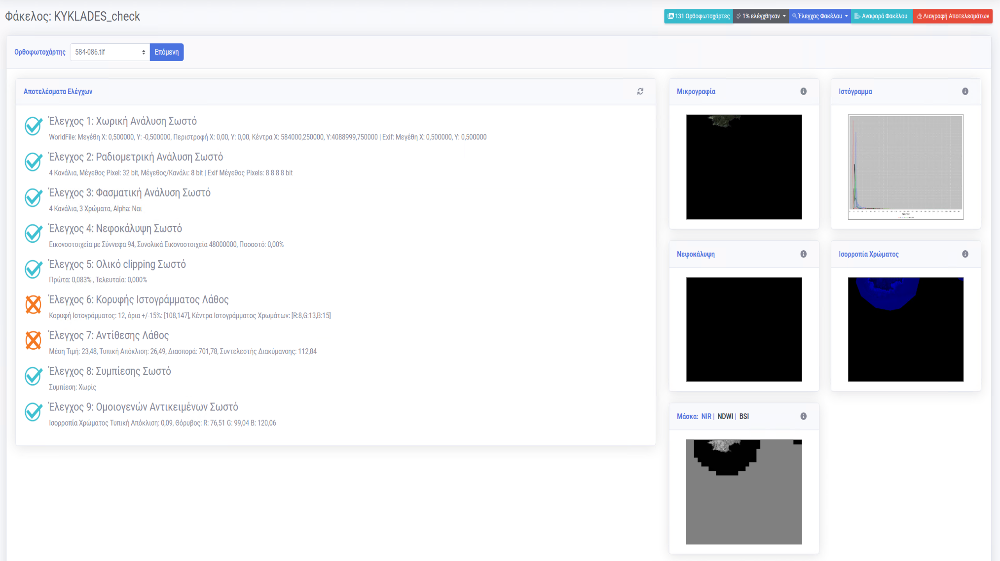

= METIS - Εφαρμογή Για Το Μαζικό Έλεγχο Ορθοφωτοχαρτών
:author: ΦΩΤΟΠΟ ΑΝΩΝΥΜΟΣ ΕΤΑΙΡΕΙΑ ΜΕΛΕΤΩΝ ΑΝΑΠΤΥΞΗΣ & ΓΕΩΓΡΑΦΙΚΩΝ ΣΥΣΤΗΜΑΤΩΝ ΠΛΗΡΟΦΟΡΙΩΝ
:revnumber: 0.14.0
:description: Ο οδηγός αυτός περιγράφει τη χρήση της εφαρμογής Metis για τον μαζικό έλεγχο ορθοφωτοχαρτών.
:doctype: book
:sectanchors:
:sectlinks:
:toc: left
:sectnums:
:appendix-caption: Παράρτημα
:appendix-refsig: {appendix-caption}
:caution-caption: Προσοχή
:chapter-signifier: Κεφάλαιο
:chapter-refsig: {chapter-signifier}
:example-caption: Παράδειγμα
:figure-caption: Εικόνα
:important-caption: Σημαντικό
:last-update-label: Τελευταία ενημέρωση
ifdef::listing-caption[:listing-caption: Καταχώρηση]
ifdef::manname-title[:manname-title: Ονομα]
:note-caption: Σημείωση
:part-signifier: Μέρος
:part-refsig: {part-signifier}
ifdef::preface-title[:preface-title: Πρόλογος]
:section-refsig: Ενότητα
:table-caption: Πίνακας
:tip-caption: Υπόδειξη
:toc-title: Πίνακας Περιεχομένων
:untitled-label: Χωρίς τίτλο
:version-label: Έκδοση
:warning-caption: Προειδοποίηση

{description}

== Σύνδεση στην εφαρμογή

Η σύνδεση στην εφαρμογή γίνεται μέσω του Active Directory λογαριασμού σας.
Χρειάζεται απλά να συμπληρώσετε το όνομα χρήστη και τον κωδικό σας στην αρχική σελίδα της εφαρμογής.

== Μενού και περιοχές

.Αρχική Οθόνη
[#home-img]
image::img/home.png[align="center"]

Η αρχική οθόνη της εφαρμογής φαίνεται στην παραπάνω εικόνα.
Σε αυτήν μπορούμε να διακρίνουμε τις παρακάτω 4 περιοχές.

. Μπάρα Κατάστασης
. Πλευρικό Μενού
. Υποσέλιδο
. Χώρος Σελίδας

=== Μπάρα Κατάστασης

Η Μπάρα Κατάστασης εμφανίζει μια ένδειξη της κατάστασης του συστήματος επεξεργασίας και τις εργασίες ελέγχου που βρίσκονται στην ουρά επεξεργασίας.
Επίσης, υπάρχει η επιλογή της βοήθειας χρήστη όπου δίνονται πληροφορίες για τις επιλογές που υπάρχουν στα μενού της εφαρμογής μέσω του `εικονιδίου του θαυμαστικού` καθώς και πληροφορίες για τον συνδεδεμένο χρήστη (Username) καθώς και το είδος του χρήστη (τοπικός ή Active Directory User).

=== Πλευρικό Μενού

Το Πλευρικό Μενού περιέχει 4 ενότητες.
Η πρώτη επιλογή `Αναφορές` οδηγεί στη σελίδα όπου εμφανίζονται όλες οι αναφορές από τους ελέγχους που έχουν ζητηθεί από τους χρήστες.
Στη δεύτερη ενότητα, εμφανίζεται μια λίστα με όλους τους φακέλους αρχείων που έχουν ανιχνευθεί από το σύστημα στον διαδικτυακό φάκελο της εφαρμογής `\\ope3filesrv\FOTOPO\`.

IMPORTANT: Μόλις προστεθούν νέες εικόνες στον διαδικτυακό φάκελο της εφαρμογής μπορεί να χρειαστεί να γίνει εκ νέου αναζήτηση για εικόνες με τη χρήση του κουμπιού ανανέωσης κάτω από τη λίστα των φακέλων

Η `ροή ελέγχων` εμφανίζει τους 1000 τελευταίους ελέγχους που έχουν εκτελεστεί από το σύστημα για όλες τις εικόνες που έχουν επεξεργαστεί.
Εμφανίζει την κατάστασή τους (`Έναρξη` ή `Ολοκλήρωση`) το αποτέλεσμα του ελέγχου (`Σωστό` ή `Λάθος`) ανάλογα με τις συνθήκες που έχουν καθοριστεί και το χρόνο που απαιτήθηκε για την ολοκλήρωση του ελέγχου.

Η `ουρά επεξεργασίας` εμφανίζει τους ελέγχους που έχουν ζητηθεί από το σύστημα και δεν έχουν εκτελεστεί ακόμα.

Οι επόμενες ενότητες αφορούν τις ρυθμίσεις της εφαρμογής, και τη λήψη αυτού του οδηγού χρήσης της εφαρμογής.

=== Υποσέλιδο

Στο υποσέλιδο φαίνονται στοιχεία για την έκδοση της εφαρμογής καθώς και την έκδοση του κώδικά της που μπορεί να χρειαστεί σε περίπτωση σφάλματος.

=== Χώρος Σελίδας

Στο Χώρο Σελίδας εμφανίζονται, ανάλογα με τη σελίδα που έχει επιλεγεί από το Πλευρικό Μενού, οι πληροφορίες για την ανάλυση των εικόνων από την εφαρμογή Metis.

== Σελίδες

=== Αναφορές

Η σελίδα `Αναφορές` εμφανίζει μια λίστα με τις αναφορές που έχουν ζητηθεί από όλους τους χρήστες μέσω της εφαρμογής.
Κάθε αναφορά μπορεί να διαγραφεί ή να ανακτηθεί (σε μορφή XLSΧ) μέσω των αντίστοιχων κουμπιών στο πάνω μέρος της λίστας.
Η λίστα των αναφορών μπορεί να ταξινομηθεί ανάλογα με κάθε στήλη του πίνακα ή με χρήση του πλαισίου αναζήτησης στο πάνω μέρος της.

.Σελίδα Αναφορών
[#reports-img]
image::img/reports.png[align="center"]

=== Φάκελοι

Η σελίδα των φακέλων εμφανίζει τα αποτελέσματα από την εκτέλεση των ελέγχων για κάθε εικόνα των Ορθοφωτοχαρτών που περιέχει.
Μέσω του dropdown μενού στο πλαίσιο `Εικόνα` μπορεί να επιλέξει ο χρήστης την εικόνα για την οποία θέλει να δει τα αποτελέσματα.

.Σελίδα Φακέλου
[#folders-img]

Στο πλαίσιο `Αποτελέσματα Ελέγχων` εμφανίζονται τα αποτελέσματα των ελέγχων που έχουν εκτελεστεί και οι σημειώσεις που προκύπτουν από την εκτέλεσή τους.

Δίπλα στα `Αποτελέσματα Ελέγχων` υπαρχουν 3 πλαίσια που προσφέρουν επιπλέον πληροφορίες σχετικά με την ανάλυση της εικόνας.

* Στο πλαίσιο `Μικρογραφία` εμφανίζεται η εικόνα σε μικρότερη ανάλυση για να δει ο χρήστης τη μορφή της εικόνας που μπορεί να εξηγεί σε κάποιο βαθμό τα αποτελέσματα των ελέγχων.
* Στο πλαίσιο `Ιστόγραμμα` εμφανίζεται το ιστόγραμμα της εικόνας για τα 3 χρώματα καθώς και για τη φωτεινότητα.
* Στο πλαίσιο `Νεφοκάλυψη`, εμφανίζεται η μάσκα της εικόνας που περιέχει τα pixel όπου έχουν ανιχνευθεί νέφη.
* Στο πλαίσιο `Μάσκες`, εμφανίζονται οι βοηθητικές μάσκες που υπολογίστηκαν για τον υπολογισμό της νεφοκάλυψης (NIR,NDWI,BSI).

Στο πάνω μέρος της σελίδας εμφανίζονται τα παρακάτω κουμπιά:
* Το πρώτο εμφανίζει τον αριθμό των συνολικών ορθοφωτοχαρτών στο φάκελο.
* Το δεύτερο εμφανίζει το ποσοστό ολοκλήρωσης των ελέγχων στους ορθοφωτοχάρτες.
* Το τρίτο ξεκινά τον έλεγχο όλων των ορθοφωτοχαρτών που περιέχονται στο φάκελο για τους ελέγχους που θα επιλέξει ο χρήστης (έλεγχος χαρακτηριστικών, έλεγχος νεφοκάλυψης).
* Το τέταρτο δίνει την επιλογή να εξαχθεί η πλήρης αναφορά των αποτελεσμάτων του φακέλου.
* το τελευταίο επιτρέπει την εκκαθάριση των ήδη υπολογισμένων αποτελεσμάτων για όλες τις εικόνες του φακέλου για τον εκ νέου έλεγχό τους.

Για την εκτέλεση των ελέγχων στο φάκελο, εμφανίζονται οι διαθέσιμες επιλογές μέσω ενός modal στο οποίο μπορεί ο χρήστης αν επιλέξει αν θα εκτελεστούν όλοι οι έλεγχοι ή μέρος αυτών. Μαζί με την επιλογή τον ελέγχων που θα εκτελεστούν ο χρήστης μπορεί να επιλέξει και μια ή περισσότερες διευθύνσεις email για την αποστολή ειδοποιήσεων για την ολοκλήρωση των ελέγχων στους ορθοφωτοχάρτες του φακέλου.
Για την εκκαθάριση των αποτελεσμάτων αντίστοιχα ο χρήστης μπορεί να επιλέξει να διαγράψει είτε το σύνολο των αποτελεσμάτων είτε μέρος αυτών με σκοπό την εκ νέου εκτέλεση των ελέγχων.

.Έλεγχος Ορθοφωτοχαρτών Φακέλου
[#check-img]
image::img/check.png[align="center"]

.Διαγραφή Αποτελεσμάτων Ελέγχων Ορθοφωτοχαρτών Φακέλου
[#results-img]
image::img/delete-results.png[align="center"]

=== Ροή Ελέγχων

Στη ροή ελέγχων εμφανίζεται μια συνοπτική κατάσταση των ελέγχων που έχουν πραγματοποιηθεί σε όλες τις εικόνες του συστήματος.
Το σύστημα διατηρεί σε αυτή τη λίστα μόνο τους 1000 τελευταίους ελέγχους που έχουν πραγματοποιηθεί για λόγους απόδοσης.

Τα στοιχεία που εμφανίζονται δεν αναφέρονται στα αποτελέσματα που έχουν αποθηκευτεί αλλά στους ελέγχους που εκτελέστηκαν.
Για κάθε έλεγχο εμφανίζεται:

. Φάκελος Ορθοφωτοχαρτών
. Αρχείο Ορθοφωτοχάρτη
. Έλεγχος (1-9)
. Κατάσταση (Έναρξη/Ολοκλήρωση) και Αποτέλεσμα (Σωστό ή Λάθος)
. Ημερομηνία Εκτέλεσης
. Χρόνος που απαιτήθηκε

.Σελίδα Ροής Ελέγχων
[#check-log-img]

=== Ουρά Επεξεργασίας

Στην ουρά επεξεργασίας εμφανίζονται όλοι οι έλεγχοι ορθοφωτοχαρτών οι οποίοι έχουν ζητηθεί και δεν έχουν ακόμη ολοκληρωθεί.
Για κάθε έλεγχο εμφανίζονται τα παρακάτω:

. Αναφορά στην οποία ανήκει
. Φάκελος Ορθοφωτοχάρτη
. Αρχείο Ορθοφωτοχάρτη
. Έλεγχοι που ζητήθηκαν (1-9)
. Ημερομηνία προσθήκης

.Σελίδα Ουράς Επεξεργασίας
[#checks-queue-img]

=== Ρυθμίσεις

Η σελίδα ρυθμίσεων εφαρμογής εμφανίζει παραμέτρους που αφορούν τις τοποθεσίες στις οποίες η εφαρμογή αναζητεί τις εικόνες των ορθοφωτοχαρτών, αποθηκεύει τα αποτελέσματα των ελέγχων προσωρινά όπως και τις αναφορές των αποτελεσμάτων αλλά και τις μικρογραφίες των εικόνων.

Σε αυτή τη σελίδα εμφανίζονται επίσης οι ρυθμίσεις σχετικά με την επεξεργασία των εικόνων των ορθοφωτοχαρτών και τις θέσεις στην ουρά επεξεργασίας.

Τέλος, εμφανίζονται το σύνολο των ελέγχων που είναι διαθέσιμοι και η κατάστασή τους, `ενεργός` ή `ανενεργός` με τη δυνατότητα (σε μελλοντική έκδοση) να ενεργοποιούνται όσοι έλεγχοι επιθυμούμε ανά πάσα στιγμή.

IMPORTANT: Η δυνατότητα αλλαγής αυτών των ρυθμίσεων είναι για την ώρα ανενεργή και υπάρχει η εμφάνισή τους για την επισκόπησή τους κατά τη χρήση της εφαρμογής.

.Σελίδα Ρυθμίσεων
[#settings-img]
image::img/settings.png[align="center"]

=== Οδηγίες Χρήσης

Μέσω αυτού του συνδέσμου μπορείτε να κατεβάσετε τον οδηγό αυτό.

== Περιγραφή ελέγχων

=== Έλεγχος 1: Χωρική Ανάλυση

[NOTE.think,caption=Περιγραφη]
====
Έλεγχος της χωρικής ανάλυσης όπου θα διαπιστωθεί ότι ο λόγος της τελικής ανάλυσης της ορθοαναγωγής προς την απόσταση δειγματοληψίας εδάφους (απόσταση μεταξύ δύο διαδοχικών κέντρων εικονοστοιχείων που μετριούνται στο έδαφος) είναι σύμφωνα με τις προδιαγραφές
====

Πρόκειται για έλεγχο των χωρικών χαρακτηριστικών της εικόνας.
Οι έλεγχοι γίνονται σε 2 σημεία:

. Image World file
. Image file

Στο `Image World file` γίνεται έλεγχος των `xPixelSize==0.5`, `yPixelSize==-0.5`, `|xRotation|==|yRotation|` και `xCenter`, `yCenter` με δεκαδικά στοιχεία `.25` και `.75` .

Στο `Image file` γίνεται έλεγχος των `Exifs` έτσι ώστε να έχουν στο κλειδί `0x830e` τιμή 0.5 στα `xPixelSize` και `yPixelSize`.

=== Έλεγχος 2: Ραδιομετρική Ανάλυση

[NOTE.think,caption=Περιγραφη]
====
Έλεγχος της ραδιομετρικής ανάλυσης όπου θα επαληθευτεί ότι είναι 11-12 bits ανά κανάλι σύμφωνα με τις προδιαγραφές
====

Πρόκειται για έλεγχο των ραδιομετρικών χαρακτηριστικών της εικόνας που γίνεται με βάση τα metadata της εικόνας στο κλειδί `BITS_PER_SAMPLE` και η τιμή των bits πρέπει να είναι τουλάχιστον 8 σε κάθε ένα από τα 4 κανάλια.

=== Έλεγχος 3: Φασματική Ανάλυση

[NOTE.think,caption=Περιγραφη]
====
Έλεγχος της φασματικής ανάλυσης όπου θα διαπιστωθεί ότι το πλήθος των καναλιών είναι σύμφωνο με τα στοιχεία παράδοσης και της προδιαγραφές
====

Πρόκειται για έλεγχο των φασματικών χαρακτηριστικών της εικόνας που γίνεται με βάση τα metadata και τα δεδομένα της εικόνας έτσι ώστε να υπάρχουν 3 components χρωμάτων και 4 συνολικά με το 4ο να είναι το NIR.

=== Έλεγχος 4: Νεφοκάλυψη

[NOTE.think,caption=Περιγραφη]
====
Έλεγχος νεφοκάλυψης ανά εικόνα και συνολικά σε συμφωνία με τις προδιαγραφές
====

Για τον έλεγχο της νεφοκάλυψης γίνεται έλεγχος της εικόνας σε 3 φάσεις.

Στην πρώτη φάση γίνεται υπολογισμός 3ων μασκών, Near Infrared (NIR), Normalized Difference Water Index (NDWI), Bare Soil Index (BSI).
Η NIR μάσκα εξάγεται από τον ίδιο τον ορθοφωτοχάρτη (band 4). Η NDWI μάσκα υπολογίζεται από την πράσινη και NIR μπάντα σύμφωνα με τον τύπο:
`(green - nir) / (green + nir)`. Η μάσκα αυτή δείχνει την περιεκτικότητα σε νερό σε κάθε pixel της εικόνας. Η μάσκα BSI  υπολογίζεται από την κόκκινη, μπλέ και NIR μπάντα σύμφωνα με τον τύπο: `(red - (blue + nir)) / (red + blue + nir))`. Η μάσκα αυτή δείχνει κατά πόσο το κάθε pixel περιέχει περιοχή οπου απεικονίζεται γυμνό έδαφος.

Στη συνέχεια για κάθε tile μεγέθους (256x256) της εικόνας δημιουργείται μια μάσκα που περιέχει τα pixel όπου υπάρχουν σύννεφα εφόσον για τις NDWI και BSI τιμές υπάρχει η εξής συνθήκη:
`(low_ndwi < ndwi < high_ndwi) and (low_bsi < bsi < high_bsi)`.

Με την ολοκλήρωση των ελέγχων όλων των tiles δημιουργείται η μάσκα που περιέχει τη συνολική νεφοκάλυψη της εικόνας.
. Σε επόμενη φάση αφαιρούνται από τη μάσκα αυτή απομονωμένα pixels που δεν αποτελούν μέρος ενός μεγαλύτερου νέφους καθώς και πυκνώνονται νέφη που περιέχουν ixels εκτός του ορίου.

Στο τέλος υπολογίζονται από τη μάσκα τα pixels που περιέχουν σύννεφα και συγκρίνονται με το συνολικό μέγεθος της εικόνας ως ποσοστό.

=== Έλεγχος 5: Ολικό clipping

[NOTE.think,caption=Περιγραφη]
====
Έλεγχος ολικού clipping το οποίο υπολογίζεται στο ιστόγραμμα φωτεινότητας σύμφωνα με τις προδιαγραφές
====

NOTE: Τα επίπεδα του γκρι υπολογίζονται από τον τύπο: `0.299 * red + 0.587 * green + 0.114 * blue`

Για τον έλεγχο αυτό υπολογίζεται το ιστόγραμμα της φωτεινότητας (επίπεδα γκρι) της εικόνας καθώς και τα ιστογράμματα των τριών χρωμάτων.
Στο ιστόγραμμα της φωτεινότητας υπολογίζεται ο αριθμός των pixels που αντιστοιχούν στις τιμές (bins) `[0,1,2,3,4]` και `[251,252,253,254,255]`.
Ο αριθμός αυτός πρέπει να είναι `<0.5%` του συνολικού μεγέθους της εικόνας.

=== Έλεγχος 6: Κορυφής Ιστογράμματος

[NOTE.think,caption=Περιγραφη]
====
Έλεγχος κορυφής ιστογράμματος από την τυπική μέση τιμή (πχ 8bit 128) και σύμφωνα με τις προδιαγραφές
====

NOTE: Τα επίπεδα του γκρι υπολογίζονται από τον τύπο: `0.299 * red + 0.587 * green + 0.114 * blue`

Για τον έλεγχο αυτό υπολογίζεται το ιστόγραμμα της φωτεινότητας (επίπεδα γκρι) της εικόνας καθώς και τα ιστογράμματα των τριών χρωμάτων.
Στο ιστόγραμμα της φωτεινότητας υπολογίζεται η τιμή (bin) στην οποία αντιστοιχούν τα περισσότερα pixels.
Το bin αυτό ελέγχεται να βρίσκεται μέσα στο όριο `+/-15%` της μέσης τιμής που για εικόνα 8bit αντιστοιχεί στο διάστημα `[108,147]`.
Στα αποτελέσματα προστίθεται επίσης και η κορυφή των ιστογραμμάτων των 3ων χρωμάτων.

=== Έλεγχος 7: Αντίθεσης

[NOTE.think,caption=Περιγραφη]
====
Έλεγχος αντίθεσης ανά κανάλι ως έλεγχος της μεταβλητότητας των ψηφιακών τιμών (DN) σαν ποσοστό των διαθεσίμων επιπέδων του γκρι και σύμφωνα με τις προδιαγραφές
====

NOTE: Τα επίπεδα του γκρι υπολογίζονται από τον τύπο: `0.299 * red + 0.587 * green + 0.114 * blue`

Για τον έλεγχο αυτό υπολογίζεται η φωτεινότητας (επίπεδα γκρι) της εικόνας και οι μέση τιμή και τυπική απόκλιση του συνόλου των τιμών.
Ο συντελεστής διακύμανσης των τιμών είναι ο λόγος της τυπικής απόκλισης προς τη μέση τιμή των επιπέδων του γκρι.
Ο συντελεστής αυτός ελέγχεται να είναι ανάμεσα στο `10%` και `20%`.
Στα αποτελέσματα παραθέτεται επίσης και η μέση τιμή, η τυπική απόκλιση και η διακύμανση των τιμών των επιπέδων του γκρι.

=== Έλεγχος 8: Συμπίεσης

[NOTE.think,caption=Περιγραφη]
====
Έλεγχος συμπίεσης στον μορφότυπο των αρχείων (GeoTiff ή/και JPEG2000) και σύμφωνα με τις προδιαγραφές
====

Πρόκειται για έλεγχο της συμπίεσης της εικόνας που γίνεται με βάση τα metadata και τα δεδομένα της εικόνας.
Πιο συγκεκριμένα ελέγχεται η ύπαρξη των παρακάτω στοιχείων:

* Καμία συμπίεση
* Συμπίεση CCITT_RLE
* Συμπίεση CCITT_T_4
* Συμπίεση CCITT_T_6
* Συμπίεση LZW
* Συμπίεση ZLIB
* Συμπίεση PACKBITS
* Συμπίεση DEFLATE

IMPORTANT: Εφόσον ανιχνευθεί οτι μια εικόνα είναι συμπιεσμένη, τότε γίνεται η αποσυμπίεσή της και οι έλεγχοι της εφαρμογής γίνονται πάνω στην αποσυμπιεσμένη εικόνα.

=== Έλεγχος 9: Ομοιογενών Αντικειμένων

[NOTE.think,caption=Περιγραφη]
====
Αναγνώριση ομοιογενών αντικειμένων και αυτόματη μέτρηση και για την ισορροπία χρώματος και θόρυβο όπου προκύπτει αφενός ως η διαφορά μεταξύ του ελάχιστου και του μέγιστου ψηφιακού συνόλου στην τριάδα υπολογιζόμενη σε σχεδόν «ουδέτερα» αντικείμενα (όπως άσφαλτος ή ταράτσες κτιρίων - δεν εφαρμόζεται σε παγχρωματικές εικόνες) και αφετέρου ως η αναλογία σήματος προς θόρυβο (SNR) που καθορίζεται σαν τον λόγο της μέσης ψηφιακής τιμής (DN) του pixel (DN Value) προς τη μεταβλητότητα (standard deviation) των ψηφιακών τιμών (υπολογισμένη σε περιοχές με ομοιόμορφη πυκνότητα μέσων τιμών) και σύμφωνα με τις προδιαγραφές
====

